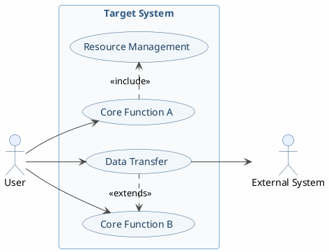
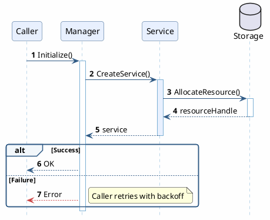
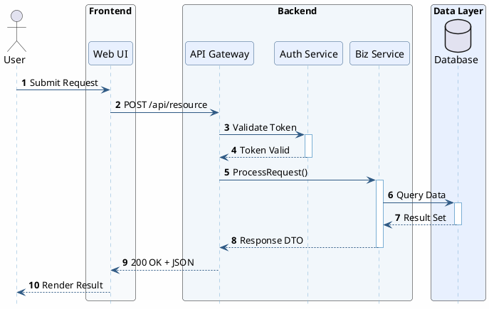
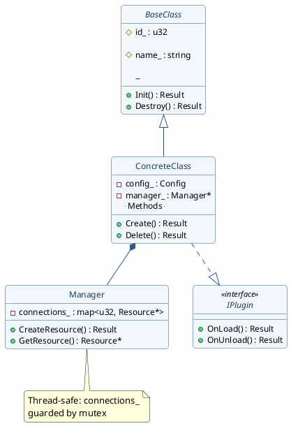
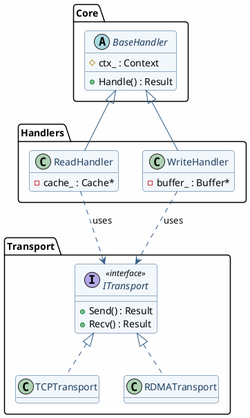
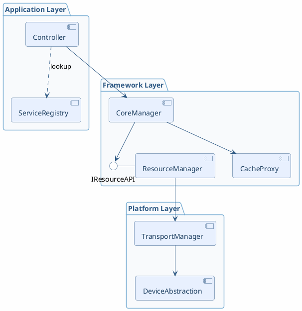
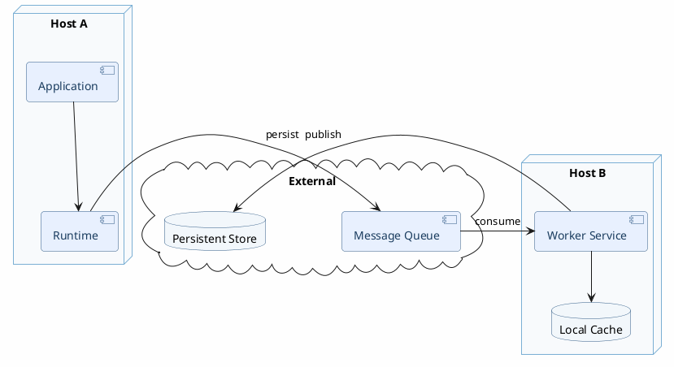
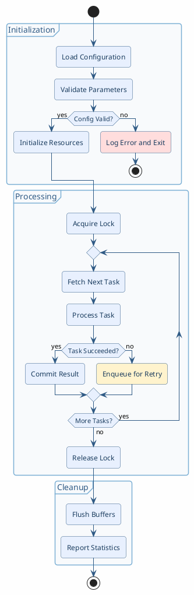
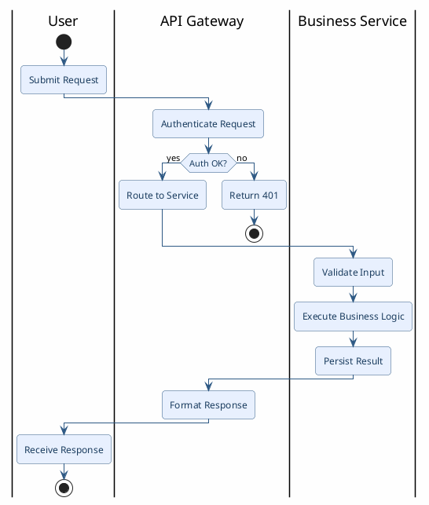

# PlantUML编写与渲染指南

## 4+1架构视图选择指南

根据需求的实际情况选择适用的视图（不必强制使用全部5个视图，按需选择2-4个）。

| 视图                  | 何时使用                     | 对应章节   | PlantUML图类型                     |
| --------------------- | ---------------------------- | ---------- | ---------------------------------- |
| 场景视图(Scenarios)   | 始终使用 -- 描述核心用例     | 流程描述   | 用例图(usecase)                    |
| 逻辑视图(Logical)     | 涉及类设计或模块交互时       | 数据描述   | 类图(class)                        |
| 过程视图(Process)     | 涉及并发、线程、时序时       | 流程描述   | 时序图(sequence)、活动图(activity) |
| 开发视图(Development) | 涉及模块划分、分层、依赖时   | 依赖性描述 | 组件图(component)、包图(package)   |
| 物理视图(Physical)    | 涉及部署、多节点、设备交互时 | 依赖性描述 | 部署图(deployment)                 |

## 全局样式规范

每张图必须包含统一的视觉主题。在 `@startuml` 之后、内容之前插入样式块。

### 基础主题（所有图通用）

```plantuml
' --- 基础样式 ---
skinparam backgroundColor    #FEFEFE
skinparam shadowing false
skinparam defaultFontName "Noto Sans CJK SC"
skinparam defaultFontSize 13
skinparam ArrowColor         #444444
skinparam RoundCorner 8
```

### 按图类型的专用样式

时序图样式：
```plantuml
skinparam sequenceArrowColor                    #2E5984
skinparam sequenceParticipantBorderColor        #2E5984
skinparam sequenceParticipantBackgroundColor    #E8F0FE
skinparam sequenceLifeLineBorderColor           #7BAFD4
skinparam sequenceGroupBackgroundColor          #F2F7FB
skinparam sequenceGroupBorderColor              #2E5984
```

类图样式：
```plantuml
skinparam class {
    BackgroundColor    #F2F7FB
    BorderColor        #2E5984
    ArrowColor         #2E5984
    FontColor          #1A3C5E
    AttributeFontSize 12
    StereotypeFontSize 11
}
```

组件图样式：
```plantuml
skinparam component {
    BackgroundColor    #E8F0FE
    BorderColor        #2E5984
    FontColor          #1A3C5E
    FontSize 14
    ArrowColor         #2E5984
}
skinparam package {
    BackgroundColor    #F8FAFC
    BorderColor        #7BAFD4
    FontColor          #2E5984
    FontStyle Bold
}
```

状态图样式：
```plantuml
skinparam state {
    BackgroundColor    #E8F0FE
    BorderColor        #2E5984
    FontColor          #1A3C5E
    FontSize 13
    ArrowColor         #2E5984
}
```

活动图样式：
```plantuml
skinparam activity {
    BackgroundColor    #E8F0FE
    BorderColor        #2E5984
    FontColor          #1A3C5E
    ArrowColor         #2E5984
}
skinparam partition {
    BackgroundColor    #F8FAFC
    BorderColor        #7BAFD4
}
```

## PlantUML编写规范

所有PlantUML代码必须能通过 `plantuml` 命令编译。遵循以下规范：

1. 使用 `@startuml <identifier>` / `@enduml` 包裹，identifier作为输出文件名
2. 紧跟 `@startuml` 后插入全局样式块
3. 使用中文标签：与文档语言保持一致
4. 保持简洁：每个图聚焦于一个视图
5. 合理使用颜色、分组、注释提高可读性

## 布局控制技巧

| 技巧       | 用法                                      | 场景                   |
| ---------- | ----------------------------------------- | ---------------------- |
| 方向控制   | `left to right direction`                 | 用例图、组件图横向展开 |
| 箭头方向   | `-up->`, `-down->`, `-left->`, `-right->` | 控制元素相对位置       |
| 虚线方向   | `.up.>`, `.down.>`, `.left.>`, `.right.>` | 依赖关系方向控制       |
| 隐藏底框   | `hide footbox`                            | 时序图简洁化           |
| 隐藏空方法 | `hide empty methods`                      | 类图只展示属性         |
| 隐藏圆圈   | `hide circle`                             | 类图去掉类型标记       |
| 缩放       | `scale 1.2` / `scale 600 width`           | 调整输出尺寸           |
| UML2 组件  | `skinparam componentStyle uml2`           | 组件图使用新版样式     |

## 视觉增强技巧

### 注释(note)

```plantuml
' 附着在元素上的注释
note right of ComponentA : 负责请求分发

' 浮动注释
note as N1
  核心设计决策：
  选择无锁队列而非互斥锁，
  以减少上下文切换开销。
end note
```

### 自动编号

```plantuml
autonumber              ' 简单编号: 1, 2, 3...
autonumber "<b>[0]"     ' 自定义格式: [1], [2]...
```

### 构造型与条件着色

```plantuml
' 给元素添加构造型
participant "API Gateway" <<facade>>
[AuthModule] << core >>

' 按构造型条件着色
skinparam component {
    BackgroundColor<<core>>      #2E5984
    BackgroundColor<<plugin>>    #7BAFD4
}
```

### 彩色箭头

```plantuml
A -[#2E5984]-> B : 控制流
A -[#CC4444]-> C : 错误路径
A .[#888888].> D : 可选依赖
```

### 生命周期管理（时序图）

```plantuml
activate Service #E8F0FE       ' 带颜色的激活
create Database                ' 在交互中创建
destroy TempHandler            ' 在交互中销毁
```

### 容器分组

| 容器      | 语法                          | 适用场景          |
| --------- | ----------------------------- | ----------------- |
| box       | `box "Name" #Color`           | 时序图参与者分组  |
| package   | `package "Name" {}`           | 逻辑分组、分层    |
| rectangle | `rectangle "Name" {}`         | 通用分组容器      |
| node      | `node "Name" {}`              | 部署图服务器/设备 |
| database  | `database "Name" {}`          | 数据库            |
| cloud     | `cloud {}`                    | 外部系统/网络     |
| partition | `partition "Name" {}`         | 活动图分区        |
| frame     | `package "Name" <<Frame>> {}` | 边框分组          |

## 示例

### 用例图（场景视图）

````markdown

````

### 时序图（过程视图）

````markdown

````

带box分组的时序图（多子系统交互）：

````markdown

````

### 类图（逻辑视图）

````markdown

````

带package分组的类图（框架级）：

````markdown

````

### 组件图（开发视图）

````markdown

````

带cloud/node嵌套的组件图（系统级）：

````markdown

````

### 活动图（过程视图）

````markdown

````

带泳道的活动图（跨角色协作）：

````markdown

````

### 状态图

````markdown
```plantuml
@startuml state_lifecycle
skinparam backgroundColor    #FEFEFE
skinparam shadowing false
skinparam RoundCorner 8
skinparam state {
    BackgroundColor          #E8F0FE
    BorderColor              #2E5984
    FontColor                #1A3C5E
    ArrowColor               #2E5984
}

[*] -right-> IDLE

IDLE -right-> INITIALIZING : Start()
IDLE : Entry / Reset counters

INITIALIZING -right-> RUNNING : Init complete
INITIALIZING -down-> ERROR : Init failed
INITIALIZING : Entry / Load config
INITIALIZING : Entry / Allocate resources

RUNNING -down-> PAUSED : Pause()
RUNNING -right-> STOPPING : Stop()
RUNNING : Do / Process tasks

PAUSED -up-> RUNNING : Resume()
PAUSED -right-> STOPPING : Stop()

STOPPING -down-> [*] : Cleanup done
STOPPING : Entry / Flush buffers
STOPPING : Entry / Release resources

ERROR -down-> [*] : Acknowledged
ERROR : Entry / Log error
ERROR : Entry / Notify admin

note right of RUNNING
  Heartbeat every 5s
  to monitoring system
end note
@enduml
```
````

带嵌套状态和并行区域的状态图：

````markdown
```plantuml
@startuml state_nested
skinparam backgroundColor    #FEFEFE
skinparam shadowing false
skinparam RoundCorner 8
skinparam state {
    BackgroundColor          #E8F0FE
    BorderColor              #2E5984
    FontColor                #1A3C5E
    ArrowColor               #2E5984
}

[*] --> Active

state Active {
    [*] --> Processing

    state Processing {
        [*] --> ReadInput
        ReadInput --> Compute
        Compute --> WriteOutput
        WriteOutput --> ReadInput
    }

    --

    state Monitoring {
        [*] --> CheckHealth
        CheckHealth --> ReportMetrics
        ReportMetrics --> CheckHealth
    }
}

Active --> Shutdown : SIGTERM
Shutdown --> [*]
@enduml
```
````

### 部署图（物理视图）

````markdown
```plantuml
@startuml deployment_physical
skinparam backgroundColor    #FEFEFE
skinparam shadowing false
skinparam RoundCorner 8
skinparam node {
    BackgroundColor          #F8FAFC
    BorderColor              #7BAFD4
    FontColor                #2E5984
}
skinparam component {
    BackgroundColor          #E8F0FE
    BorderColor              #2E5984
    FontColor                #1A3C5E
}
skinparam database {
    BackgroundColor          #F2F7FB
    BorderColor              #2E5984
}

node "Application Server" {
    [app.so] as App
    [protocol_stack] as Proto
}

node "Compute Device" {
    [kernel.so] as Kernel
    [device_service] as Service
}

cloud "External Network" {
    [Load Balancer] as LB
    database "Object Storage" as OSS
}

LB -down-> App : HTTPS
App -right-> Proto : Control Plane
Proto -down-> Service : Bus Protocol
Kernel -left-> Service : Data Plane
App .right.> OSS : Backup
@enduml
```
````

## 安装与渲染命令

### 安装

```bash
# macOS
brew install plantuml

# Linux
apt-get install -y plantuml
# 或手动下载 jar
curl -L -o /tmp/plantuml.jar https://github.com/plantuml/plantuml/releases/latest/download/plantuml.jar
```

### 渲染流程

1. 创建临时目录：
```bash
mkdir -p /tmp/designdoc_puml
```

2. 从markdown中提取每个plantuml代码块为 `.puml` 文件，文件名使用 `@startuml` 后的标识符

3. 批量渲染为PNG：
```bash
# 使用 plantuml 命令
plantuml -tpng -o /tmp/designdoc_puml/ /tmp/designdoc_puml/*.puml

# 或使用 jar
java -jar /tmp/plantuml.jar -tpng -o /tmp/designdoc_puml/ /tmp/designdoc_puml/*.puml
```

4. 更新markdown中的图片引用：
````markdown
<!-- before -->
```plantuml
@startuml usecase_scenario
...
@enduml
```

<!-- after -->

````

### 语法检查

```bash
plantuml -syntax /tmp/designdoc_puml/*.puml
```
